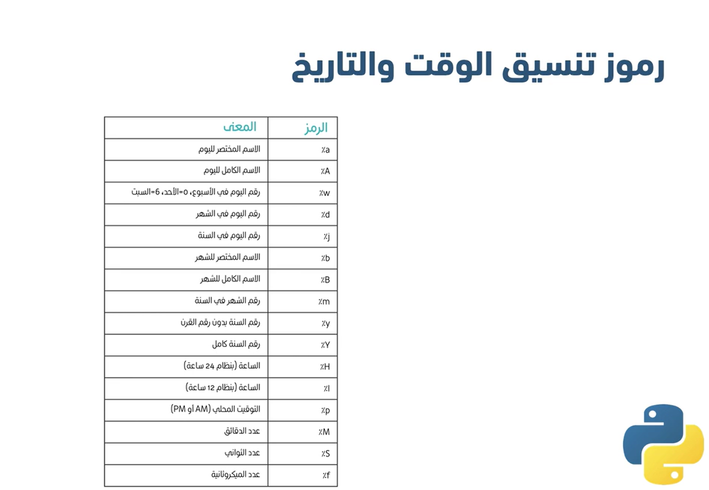

---
tags:
  - بايثون
تم:
aliases:
مسار التعلم: سطر.كود
مسار: AI
cssclasses:
ب:
---


مسار: AI
مسار التعلم: سطر.كود

## Python 101

### Variables | المتغيرات

طرق الكتابة

```python
name = "d"
age = 14
name , age = "d" , 14
```

### **Inputs and Outputs | المدخلات والمخرجات**

طرق الكتابة 

```python
input()
# يكمن كتابةالمطلوب من المستخدم داخلها
input("input your name")
# نضعه في متغير 
name = input("input your name")
print("hallo" , name)
```

### Operators Type | انواع المعاملات

المعاملات الحسابيّة Arithmetic Operators

```python
#الجمع
result = 2 + 5
#الطرح
result = 4 - 10
#الضرب
result = 2 * 2
#القسمة
result = 2 / 6
#باقي القسمة
result = 10 % 3
print(result)
# هناك ايضا اختصارات مثل اختصار هذه المعادلة 
result = 10
result = result - 5
#في هذه المعادلة
result -= 5

```

معاملات المقارنة Comparison Operators

```python
#معامل التساوي
result = 6 == 3
print(result)
#معامل عدم التساوي
result = 8 != 7
print(result)
#معامل اكبر من
result = 3 > 2
print(result)
#معامل اصغر من 
result = 1 < 4
print(result)
# معامل اكبر من او يساوي
result = 3 >= 3
print(result)
#معامل اصغر من او يساوي
result = 7 <= 3
print(result)
```

المعاملات المنطقية Logical Operators

```python
#معامل And
not_raining = True
not_foggy = True
is_sunny = not_raining and not_foggy
print(is_sunny) #Ture
#قيمة واحدة صحيحه والباقي خطأ
#معامل Or
is_raining = True
is_foggy = False
not_sunny = is_raining or is_foggy
print(not_sunny) #Ture
#قيمة واحدة خطأ والباقي صحيح
#معامل Not
is_student = True
print(not is_student) #Flase
#يغير القمية من صحيحه الى خطأوالعكس
```

### Data Types | انواع  البيانات

- النوع String: يمثل هذا النوع البيانات النصيّة مثل
- النوع Integer: يمثل هذا النوع البيانات الرقميّة من الأعداد الصحيحة
- النوع Float: يمثل هذا النوع البيانات الرقميّة من الأعداد ذات النقاط العشرية
- النوع Complex: يمثل هذا النوع البيانات الرقمية من الاعداد المركبة
- النوع Boolean: يمثل هذا النوع إحدى القيمتين True أو False.
- النوع None: يدل هذا النوع على عدم وجود قيمة.

```python
name = 'Ahmed' #<class 'Str'>
age = 20 #<class 'int'>
age = 20.00 #<class 'Float'>
num = 15j #<class 'complex'>
is_student = True #<class 'bool'>
is_employee = False #<class 'bool'>
home_address = None #<class 'none'>
```

str() داله تقوم بتحويل البيانات الى string

int() دالة تقوم بتحويل البيانات الى integer

float() دالة تقوم بتحويل البيانات الى float

### **Advanced Data Type | أنواع البيانات المتقدمة**

sequence هو متغير به مجموعه من البيانات على هيئة

- list
    - 
    
    ```python
    names = [ "eslam" , 20 , True , 4.9 ]
    #يمكن تعديل القوائم بعد انشائها
    #تعتبر نوع من انواع البيانات
    print(type(names)) #<calss 'list' >
    #index هو موقع العنصر في القائمة فالعنصر الاول 0 والثاني 1 وهكذا
    print(names[2]) # True
    #لتغيير عنصر معين 
    names[1] = "Ahmed"
    print(names) # [ eslam , Ahmed , True , 4,9 ]
    #الدالة append() تضيف عنصر الى نهاية القائمة 
    names.append(20)
    print(names) #[ "eslam" , "Ahmed" , True , 4,9 , 20]
    #الدالة insert(index , value) تستقبل قيمتين الموقع المراد اضافة العنصر به والعصنر
    names.insert(2 , "Mohamed")
    print(names) #[ "eslam" , "Ahmed" , "MOhamed" , True , 4,9 , 20]
    #الدالة remove( value ) تقوم بحذف عنصر  معين من الدالة
    names.remove(4.9)
    print(names) #[ "eslam" , "Ahmed" , "MOhamed" , True , 20]
    #الدالة clear() تقوم بمسح جميع عناصر القائمة 
    names.clear()
    print(names) #[]
    ```
    
- tuple
    - 
    
    ```python
    co = ( "Eslam" , 20 , "ahmed" )
    # لا يمكن التعديل عليها بعد انشائها 
    #تعتبر نوع من انواع البيانات
    print(type(co)) #<calss 'tuple' >
    #index هو موقع العنصر في القائمة فالعنصر الاول 0 والثاني 1 وهكذا
    print(names[2]) # Ahmed
    # لا يمكن استخدام دوال الاضافة والحذف 
    # يمكن كتابتها بدون الاقواس
    co = "Eslam" , 20 , "ahmed"
    print(type(co)) #<calss 'tuple' >
    ```
    
- ****Dictionary
    - 
    
    ```python
    p = {"name" : "Eslam" , "age" : 20 }
    #وصول اكثر سهولة للبيانات الضخمة
    # تعتبر نوع من انواع البيانات 
    print(type(p)) #<class 'dict'>
    # للوصول الى عنصر استخدم المفتاح الخاص به 
    print(p["name"])
    # الدالة values() تقوم باحضار جميع عناصر القاموس
    print(p.vlaues) #dict_values(['Eslam', 20])
    # الدلة keys() لطباعة جميع مفاتيح الوصول الموجوده في القاموس
    print(p.keys) #dict_keys(['name', 'age'])
    #لا يمكن أن يحتوي القاموس على عنصرين بنفس المفتاح
    ```
    

### Condition | الشروط

if statement | الجمل الشرطية

```python
path = "computer"
#if الشرط . المتغير:
if path == "computer":
	print("web dev") #hi
#elif اذا كنت ترغب في اضافة اكثر من شرط
#elif الشرط . المتغير:
elif path == "ios":
	print("photograph")
elif path == "android":
	print("games")
#else في حال أردنا تنفيذ أمر برمجي مُعيّن عند عدم تحقق الشرط
else:
	print("fi") #web dev
# مللاحظة يجب ان تكون نفس الدالة
```

### Loop | التكرار

عندما نريد طباعة امر برمجي اكثر من مرة

```python
#while دالة تكرار وتكتب على الهيئة التالية
pp = 1 
while pp <= 5:
	print(pp)
	pp+= 1 
#سيقوم بطباعة المتغير عدد لا نهائي من المرات فاذا كنت تريد الى حد معيد ضع السطر الخامس

#for العصنر in المتغير:
# يقوم بطباعة عنصر واحد من الدالة في  كل دورة
gg = [ "qw" , "we" , "er" ]
for s in gg:
	print(s)

#for in range() تقوم بطباعة على حسب النطاقات
# عند طلب طباعة 10 فانه يعاملها على انها index
for q in range(10):
	print(q) # 0 , 1 , 2 , .... , 9
#range(start, end , step)
#range(start , end)
```

### Functions | الدوال

الدالة عبارة عن مجموعة من الأوامر البرمجيّة مصممة لأداء مهمة معينة ويتم تنفيذ الدالة عند استدعائها باسمها، وتهدف الدوال إلى تقسيم الأوامر البرمجيّة الكبيرة إلى مجموعات صغيرة تتشارك لتكون برنامجًا واحدًا.

```python
# هي مجموعة من الاومر البرمجية لا تنفذ الا عند استدعائها
# def اسم الدالة():

def cut(): 
	name = input("Enter your Name ")
	time = input("Enter the Time ")
	print("good " + time + "," +name + "!")

cut() #good night,Eslam! 

# يمكن استدعاء الدالة في اي وقت واي مكان في الكود وحتي اكثر من مره
# عند التعديل على الدالة يتم تعديل مخرجات الاستدعائات ايضا
# وتعد ميزه وعيب في نفس الوقت

# يمكن استقبال مدخلات في الدالة عن طريق الاقواس
# def اسم الدالة(qاسم المتغير):

def print_number(s):
		for i in range(s):
				print(i)
#سيقوم بطباعة الدالة من index 0 حتي قيمة المتغير المكتوبه 
print_number(9)
print_number(5)
print_number(2)

# يمكن ان تستقبل اكثر من مدخل ارقام او نصوص
def s(num1 , num2):
		print(num1 +num2)

s(1, 4) #5
s("Hi ","p") #Hi p

# return امر ارجاع الاستدعاء فعند استدعاء الدالة يقوم براجاع القيم ثم يقوم بحسابها
def qq(n1 , n2):
		ra = n1 + n2
		return ra
	
value = qq(1,2)
print(value)#3
# يمكن ايضا
value2 = qq(1,2) + qq(1,2)
print(value2)#6

# يمكن استخدام مخرجات دالة كمدخلات داله اخري
print_number(value)
```

### Project Python 101

- مشروع
    
    **نهاية هذا المشروع سيكون الطالب قادرًا على**
    
    1. فهم آلية عمل الدوال.
    2. التعامل مع القواميس Dictionary.
    3. استخدام loop مع Dictionary.
    4. فهم طريقة عمل loop مع if statement.
    
    # **المتطلبات Requirements**
    
    قم ببناء برنامج يُمثل دليل الهاتف، بحيث يقوم باستقبال رقم الهاتف، ويعود لنا باسم صاحب الرقم يُمكن الاستعانة بالجدول التالي:
    
    | **الاسم** | **الرقم** |
    | --- | --- |
    | Amal | 1111111111 |
    | Mohammed | 2222222222 |
    | Khadijah | 3333333333 |
    | Abdullah | 4444444444 |
    | Rawan | 5555555555 |
    | Faisal | 6666666666 |
    | Layla | 7777777777 |
    
    في حال تم إرسال رقم موجود في الدليل سيتم طباعة اسم صاحب الرقم المُدخل، وفي حال تم إدخال رقم غير موجود بدليل الهاتف، تطبع الرسالة:
    
    ```python
    Sorry, the number is not found
    
    ```
    
    في حال كان رقم الهاتف أقل أو أكثر من ١٠ أرقام، أو قيمة أُخرى (يحتوي على أحرف ورموز وقيم منطقيّة على سبيل المثال) سيتم طباعة الجملة:
    
    ```python
    This is invalid number
    
    ```
    
    أسئلة إضافيّة:
    
    - البحث باسم الشخص.
    - اجعل البرنامج يقوم بالسماح للمستخدم بإضافة مستخدم جديد مع رقمه للدليل.
- حل المشروع
    
    ```python
    phone_book = {
        "1111111111": "Amal",
        "2222222222": "Mohammed",
        "3333333333": "Khadijah",
        "4444444444": "Abdullah",
        "5555555555": "Rawan",
        "6666666666": "Faisal",
        "7777777777": "Layla"
    }
    # دالة التحقق من صحة الرقم 
    def is_valid_number(number):
        count = 0
        for char in number:
            count += 1
        if count != 10:
            return False
        for char in number:
            if char < '0' or char > '9':
                return False
        return True
    # دالة البحث عن الاسم باستخدام الرقم 
    def find_name_by_number():
        phone_number = input("Enter the phone number: ")
        if is_valid_number(phone_number):
            for number in phone_book:
                if phone_number == number:
                    print(phone_book[phone_number])
                    return
            print("Sorry, the number is not found")
        else:
            print("This is invalid number")
    
    دالة البحث عن الرقم باستخدام الاسم
    
    def find_number_by_name():
        name = input("Enter the name:")
        for number, owner in phone_book.items():
            if owner == name:
                print(number)
                return
        print("Sorry, the name is not found")
    
    دالة إضافة جهة اتصال جديدة
    
    def add_new_contact():
        new_name = input("Add new name:")
        new_number = input("Add new number:")
        if is_valid_number(new_number):
            phone_book[new_number] = new_name
            print("Contact added successfully!")
        else:
            print("This is invalid number")
    
    استدعاء الدالات
    
    find_name_by_number()
    find_number_by_name()
    add_new_contact()
    ```
    
- اجابتي
    
    ```python
    phone_book = {
          "1111111111": "Amal",
          "2222222222": "Mohammed",
          "3333333333": "Khadijah",
          "4444444444": "Abdullah",
          "5555555555": "Rawan",
          "6666666666": "Faisal",
          "7777777777": "Layla"
    }
    
    #a دالة التحقق من الرقم 
    def check_number (number) :
        count = 0
        for i in number:
            count += 1
        if count != 10:
            return False
        for i in number:
            if char < '0' or char > '9':
                return False
        return True
    
    #b دالة البحث عن الاسم باستخدام الرقم
    def find_name_by_num () :
        phone_number = input("Enter the phone number: ")
        if check_number(phone_number):
            for number in phone_book:
                if phone_number == number:
                    print(phone_book[phone_number])
                    return
            print("Sorry, the number is not found")
        else:
            print("This is invalid number")
    
    #c دالة البحث عن الرقم باستخدام الاسم
    def find_num_by_name ()
        name = input("Enter the name:")
        for number, owner in phone_book.items():
            if owner == name:
                print(number)
                return
        print("Sorry, the name is not found")
    
    #d دالة اضافة جهة اتصال جديدة
    
    def add_new_content ()
        new_name = input("Add new name:")
        new_number = input("Add new number:")
        if is_valid_number(new_number):
            phone_book[new_number] = new_name
            print("Contact added successfully!")
        else:
            print("This is invalid number")
    
    #e استدعاء الدالات
    find_name_by_num ()
    find_num_by_name ()
    add_new_content ()
         
          
    ```
    

---

## Python 102

### Dates and Numbers | التواريخ والارقام

```python
# لايجاد القيمة المطلقة 
print(abs(-999)) #999
# للتقريب لاقرب رقم صحيح
print(round(3.673)) #4
# للتقريب لاقرب علامه عشرية
print(round(3.673, 2)) #3.67
# لرفع رقم لاس معين 
print(pow(3, 2)) # 9
# لايجاد اكبر قيمة 
print(max(10 , 25 , 9 , 5))#25
# لايجاد اصغر قمية 
print(min(10, 25 ,9 ,5))#5
# لجمع مجموعه من الارقام 
print(sum(10, 5 , 5))#20
# لايجاد الجزر التربيعي يجب استدعاد مكتبة الرياضيات
import math
print(math.sqrt(144))#12.00
# لايجاد باقي القسمة 
import math
print(math.remiander(26, 5))# 1.00
# للحصول على رقم عشوائي
import random
print(random.randint(1,100))#random number
#انشاء تواريخ
import datatime
date = datatime.data(2020, 2, 13)
print(data) #2020-02-13
print(data.year)#2020
print(data.month)#2
print(data.day)#13
# انشاء الوقت
import datatime
time = datatime.time(14, 33 , 15)
print(time)#14:33:15
print(time.hour)#14
print(time.minute)#33
print(time.second)#15
#معرفة الوقت الحالى
import datatime
now =datatime.datatime.today()
print(now)#الوقت الحالى
print(now.year)#السنة الحالية
print(now.month)#الشعر الحالى
print(now.day)#اليوم الحالى
print(now.hour)#الساعه الحالية
print(now.minute)#الدقيقة الحالية
print(now.second)#الثانية الحالية
# تحويل التاريخ الى نص
date = datatime.data(2020, 2, 13)
time = datatime.time(14, 5 , 17)
vvvvvvvvvvvvvvvvv
DATA = data.strftime('%A %8 %Y')
print(DATA)#Thursday February 2020
TIME = time.strftime('%I %M %S')
print(TIME)#02 05 17

```



### Advanced Sequence | أنواع البيانات المتقدمة بشكل اعمق

- مفهوم indexing الوصول الى العناصر في List, stirng, tuple
    - العد في لغات البرمجة يبدأ من 0 واذا اردت البدء من الاخير فالعد من -1
    
    ```python
    #تعبر عن index باقواس مربعه []
    alphabet = "abcdefghijklmnopqrstuvwxyz"
    print(alphabet[0])#a
    the_list = [1, 2 , 3]
    the_tuple = (1, 2, 3)
    print(the_list[1])#2
    print(the_tuple[-2])#2
    ```
    
- مفهوم slicing الوصول الى نطاق معين من العناصر بدلا من عنصر واحد
    - 
    
    ```python
    #نطاق مغلق [from نفس النقطه: to ما قبلها]
    text = "this is python cousre"
    print(text[8:14])#python
    # نطاق مفتوح [from : ]
    #او [ ;to]
    #او [:]
    text = "this is python cousre"
    print(text[8:])#python cousre
    print(text[:14])#this is python
    print(text[:])#this is python cousre
    print(text[-6:])#cousre
    the_list = [1, 2 , 3, 4, 5]
    the_tuple = (1, 2, 3, 4, 5)
    print(the_list[2:])#[3, 4, 5]
    print(the_tuple[:2])#(1, 2, 3)
    print(the_list[:])#[1, 2 , 3, 4, 5]
    print(the_tuple[-3:])#(3, 4, 5)
    #[from:to:step]
    alphabet = "abcdefghijklmnopqrstuvwxyz"
    print(alphabet[0:7:2])#aceg
    print(alphabet[5:0:-1])#fedcb
    the_list = [1, 2 , 3, 4, 5,6]
    the_tuple = (1, 2, 3, 4, 5, 6)
    print(the_list[3:0:-2])#[4, 2]
    print(the_tuple[-1:-6:-2])#(6, 4, 2)
    
    ```
    
- الدالة slicing
    - 
    
    ```python
    alphabet = "abcdefghijklmnopqrstuvwxyz"
    print(alphabet[0:5])#abcde
    s= slice(0, 5)
    print(alphabet[s])#abcde
    s= slice(0, 5, 2)
    print(alphabet[s])#ace
    the_list = [1, 2 , 3, 4, 5, 6]
    the_tuple = (1, 2, 3, 4, 5, 6)
    s= slice(0, 5, 2)
    print(the_list[s])#[1, 3, 5]
    print(the_tuple[s])#(1, 3, 5)
    ```
    
- الدالة index
    - البحث عن عنصر معين موجود ام لا اذا كان موجود ستعطيني رقم الindex له واذا لا ستعطي error
    - هذه الداله تعطي اول تطابق لا غير
    
    ```python
    text= "lorem ipsum dolor sit amet, consecteur adioiscing elit, sed do"
    the_list = [1, 2 , 2, 3]
    the_tuple = (4, 5)
    
    print(text.index("do"))#12
    print(text.index("DO"))#Error
    print(the_list.index(2))#1
    print(the_tuple.index(4))#0
    
    ```
    
- الدالة len
    - عدد العناصر
    
    ```python
    alphabet= "abcdefghijklmnopqrstuvwxyz"
    the_list = [1, 2 , 3, 4]
    the_tuple = (1, 2, 3)
    print(len(alphabet))#26
    print(len(the_list))#26
    print(len(the_tuple))#26
    
    ```
    
- الدالة count
    - كم مره تكرر العنصر المعين
    
    ```python
    the_string= "This is the student Noora"
    the_list= [1, 2, 2 ,3, 3, 3, 3]
    the_tuple= (4, 4, 4, 4, 5, 5, 5, 5, 5)
    print(the_string.count("s"))#3
    print(the_string.count("S"))#0
    print(the_string.count("Noora"))#1
    print(the_list.count(2))#2
    print(the_tuple.count(4))#4
    ```
    
- المعامل in
    - عنصر ما أو مجموعة من العناصر المعينة موجودة ام لا
    
    ```python
    text= "lorem ipsum dolor sit amet, consecteur adioiscing elit, sed do"
    print("do" in text)#true
    print("DO" in text)#false
    print("do" not in text)#false
    the_list= [1, 2, 3]
    the_tuple= (4, 5)
    print(1 in the_list)#true
    print(1 not in the_tuple)#true
    
    ```
    
- الدمج والتكرار
    - 
    
    ```python
    n1= "Eslam"
    n2= 'Ahmed'
    print(n1 + n2)#EslamAhmed
    print(n1 + ' ' +n2)#Eslam Ahmed
    print(n1*3)#EslamEslamEslam
    l1= [1, 2, 3]
    l2=[4, 5, 6]
    t1= (1, 2, 3)
    t2=(4, 5, 6)
    print(l1 +l2)#[1, 2, 3, 4, 5, 6]
    print(t1 +t2)#(1, 2, 3, 4, 5, 6)
    print(l1*3)#[1, 2, 3, 1, 2, 3, 1, 2, 3]
    ```
    

### Advanced String | النصوص  بشكل اعمق

- البحث ياستخدام الدالة find
    - البحث عن نص معين
    - اذا وجد ستعطينه index
    - اذا لا -1
    
    ```python
    text= "lorem ipsum dolor sit amet, consecteur adioiscing elit, sed do"
    print(text.find('do'))#12
    print(text.rfind('do'))#12 اخر تطابق
    print(text.find('DO'))#-1
    print(text.find('it', 50, 60))#53
    ```
    
- تحويل النص الى قائمة
    - split()
    - يفصل عن وجود مسافة
    - تكتب القيمة التي يراد الفصل عندها وتختفي من القائمة
        
        ```python
        text= 'A, B, C'
        stl= text.split()
        print(stl)#['A, ', 'B, ', 'C']
        stl2= text.split(',')
        print(stl2)#['A', ' B', ' C']
        tex2t= 'This is a string'
        stl3= tex2t.split('s')
        print(stl3)#['thi', ' i', ' a ', ' tring]
        stl3= tex2t.split('s', 1)
        print(stl3)#['thi', 'is a string]
        ```
        
- التحويل الى نص
    - join()
    - تحويل List، Tuple و Dictionary
    
    ```python
    the_list=['A', 'B', 'C']
    lts= ' '.join(the_list)
    print(lts)#A B C
    lts= '#'.join(the_list)
    print(lts)# A#B#C 
    ```
    
- التحقق من النص
    - نص ام ارقام ام حروف كبيرة ام صغيرة
    
    ```python
    v= "A987"
    print(v.isalnum())#ture تحتوي على حروف وارقام فقط
    print(v.isdigit())#false هل تحتوي على ارقام فقط
    ```
    
    
    
- الدالة replace
    - أخذ نص معين والتغيير عليه
    
    ```python
    values = '1\n2\n3\n4'
    print(values)
    #1
    #2
    #3
    #4
    print(values.replece('\n', ','))#1,2,3,4
    print(values.replece('\n', ',', 2))
    #1,2
    #3
    #4
    ```
    
- الدالة strip
    - ازالة المسافات أو نص معين
    
    ```python
    teee = "    py   "
    print(teee.strip())#py
    print(teee.lstrip())#py   
    print(teee.rstrip())#    py
    ```
    
- التلاعب في النص
    - 
    
    ```python
    sss = "This is Python"
    print(sss.upper())#THIS IS PYTHON
    print(sss.lower())#this is python
    print(sss.swapcase())#tHIS IS pYTHON
    print(sss.title())#This Is Python
    ```
    
- مفهوم Raw string
    - R, r
    
    ```python
    ss = '\t Python'
    print(ss)#   Python
    ss1 = r'\t Python'
    print(ss1)#\tPython
    sss = 'c:\\xfolder\\xsub\\txt.f'
    print(SSS)#c:\xfolder\xsub\txt.f
    ss2 = r'c:\xfolder\xsub\txt.f'
    print(SS2)#c:\xfolder\xsub\txt.f
    s1 = r'\'
    print(s1)#error 
    ```
    
- الدالة format
    - 
    
    ```python
    f_na ='eslam'
    l_na ='ahmed'
    age = 21
    print('im {} {}, and im {} '.format(f_na, l_na, age))
    #im eslam ahmed, and im 21
    print('im {2} {1}, and im {0} '.format(f_na, l_na, age))
    #im 21 ahmed, and im eslam
    print('im {ff} {ll}, and im {aa} '.format(ff=f_na, ll=l_na, aa=age))
    #im eslam ahmed, and im 21
    print(f'im {f_na} {l_na}, and im {age} ')
    #im eslam ahmed, and im 21
    #str = {:s}
    #num = {:d}
    #float = {:f}
    #{:_d}555_111_444
    #{:.2f}10.00{:3f]10.000
    #{index:.2f}
    #python{:.2s} py
    
    ```
    

### Advanced Lists | القوائم  بشكل اعمق

- القوائم ثنائية الابعاد
    - 
    
    ```python
    vv = [1, ture, 'py']
    print(vv[0])#1
    v1 = [[1, 2, 3], ture, 'py']
    print(v2[0])#[1, 2, 3]
    v2 = [[1, 2, 3], ture, 'py']
    print(v2[0][2])#3 
    v3 = [[1, 2, 3],
    			[4, 5, 6],
    			[7, 8, 9]
    			]
    print(v3[1][1])#5
    ```
    
- الدالة filter
    - تستقبل مدخلين
    - داله تحتوي على شرط وقائمة
    - والعناصر التي تتطابق مع الشرط هتطبع
    
    ```python
    age = [30, 9, 15, 22, 17, 44, 26, 5]
    #طريقة عادية
    adults = []
    
    def filtered_ages(ages):
    		for age in ages:
    				if age >= 18:
    						adults.append(age)
    						
    		return adults
    		
    print(filtered_ages(ages))#[30, 22, 44, 26]
    
    #طريقة الدالة filter
    def filtered_ages(ages):
    		return age >= 18
    print(filter(filtered_ages, ages))
    #filrer object at dgfgasgnfig
    print(list(filter(filtered_ages, ages)))
    #[30, 22, 44, 26]
    ```
    
- الدالة map
    - تستقبل function, list
    - والعناصر التي تتطابق مع الشرط هتطبع
    
    ```python
    numbers = [5, 10, 20, 25, 50]
    #طريقة طويلة
    sq_numbers = []
    
    def square(numbers):
    		for num is numbers:
    				sq_numbers.append(num**2)
    				
    		return sq_numbers
    		
    print(sq_numbers)#[25, 100, 400, 625, 2500]
    
    #طريقة الدالة map
    def square(numbers):
    		return num ** 2
    print(map(square, numbers))##filrer object at dgfgasgnfig
    print(list(map(square, numbers)))
    #[25, 100, 400, 625, 2500]
    ```
    
- الدالة sort
    - ترتب تصاعديا
    - تنازلي باستخدام reverse
    
    ```python
    l1 = [9, 5, 1, 8]
    l2 = ['eslam', 'ahmed', 'sss']
    print(l1.sort())#[1, 5, 8, 9]
    print(l2.sort())#['ahmed', 'eslam', 'sss']
    print(l1.sort(reverse=ture))#[9, 8, 5, 1]
    print(l2.sort(reverse=ture))#['sss', 'eslam', 'ahmed']
    
    ```
    
- الدالة reverse
    - 
    
    ```python
    n1 = ['a', 'b', 'c', 'd']
    print(n1.reverse())#['d', 'c', 'b', 'a']
    ```
    
- مفهوم list comprehension
    - انشاء قائمة بداخلها قائمة موجوده
    
    ```python
    lst = [1, 2, 3, 4]
    #طريقة طويلة
    multiplied_list = []
    
    for num in lst:
    		multiplied_list.append(num*2)
    
    print(multiplied_list)#[2, 4, 6, 8]
    
    #طريقة list comprehension
    multiplied_list = [num*2 for num in lst]
    print(multiplied_list)#[2, 4, 6, 8]
    
    #طريقة طويلة مع شرط معين
    multiplied_list = []
    
    for num in lst:
    		if(num > 3):
    		multiplied_list.append(num*2)
    
    print(multiplied_list)#[8]
    
    #طريقة list comprehension
    multiplied_list = [num*2 for num in lst if num > 3]
    print(multiplied_list)#[8]
    
    #طريقة طويلة مع اكثر من شرط معين
    multiplied_list = []
    
    for num in lst:
    		if(num > 3) and num % 5 == 0:
    		multiplied_list.append(num*2)
    
    print(multiplied_list)#[10]
    
    #طريقة list comprehension
    multiplied_list = [num*2 for num in lst if num > 3 and num % 5 == 0]
    print(multiplied_list)#[10]
    ```
    

### Advanced Functions | الدوال  بشكل اعمق

- مفهوم Positional Arguments
    - تعرف ايضا بRequired Argument
    - يتم تمرير المدخلات يتم استقبالاها بنفس الترتيب الموجود في الباراميتر
    - يجب ان تتوافق عدد المدخلات مع عددها في تعريف الداله
    - 
    
    ```python
    def info (name, age)
    	print('my name is ' ,+ name +, 'and I am ' ,age, 'years old') #my name is Eslam and I am 21 years old
    	
    info ('Eslam', 21)
    
    info (21, 'Eslam')#my name is 21 and I am Eslam years old وهذا خاطئ
    
    ```
    
- مفهوم Keyword Arguments
    - هي تزويد الدالة بالبيانات عن طريق كتابة اسم الباراميتر متبوعه بالقيمة التي سيأخذها
    - لا يفرق فيها ترتيب لاني كتبت المتغير وقيمته ولكن يجب ان يكون بنفس المسمي والعدد
    - لو عابز poistinal argument وkeyword مع بعض لازم ال poisitional يبقي الاول  ويجب ان اعدلها ايضا في تعريف الداله
    
    ```python
    def info (name, age)
    		print('my name is ' ,+ name +, 'and I am ' ,age, 'years old') #my name is Eslam and I am 21 years old
    	
    info (name = 'Eslam', age = 21)
    info (age = 21 , name = 'Eslam')# هي هي
    
    def info (ageو name)
    	print('my name is ' ,+ name +, 'and I am ' ,age, 'years old') #my name is Eslam and I am 21 years old
    	
    info (21, name = 'Eslam')#poistional -> keyword
    ```
    
- مفهوم Default Parameter
    - عندما يقوم المبرمج بعمل الداله ممكن يعطي قيم افتراضية للباراميتر وسيتم تمرير هذه القيم ما لم يتم تمرير
    - ممكن تاخد مدخل واحد والباقي من الاعداد الافتراضي
    - ويرتب مثل poisitional ما لم اكتبها مثل keyword
    
    ```python
    def info (name = ُ'Mohamed', age = 14, course = 'c')
    		print('my name is ' ,+ name +, 'and I am ' ,age, 'years old and I am taking about ',+ course +,'course') #my name is Mohamed and I am 14 years old and I am taking about c
    
    info ()
    def info (name = ُ'Mohamed', age = 14, course = 'c')
    	print('my name is ' ,+ name +, 'and I am ' ,age, 'years old and I am taking about ',+ course + ,'course') #my name is Eslam and I am 21 years old and I am taking about Python
    info (name = 'Eslam', age = 21)
    ```
    
- مفهوم Argument Packing
    - استقبال عدد غير محدد من المدخلات في الباراميتر واحد
    - يقوم هذا الباراميتر بحفظهم علي شكل tuple
    - 
    
    ```python
    def (x,y,z)
    #a اصبحت الدالة لحساب متوسط 3 اعداد فقط
    #b لن تعمل الدالة عند تمرير اكثر من 3 اعداد
    
    def (x, y=0,z=0)
    #c لن تعرف الداله على اي عدد تقسم
    
    def (nums_list)# المدخل على هيئة قائمة 
    #d سيتوجب علي مستخدم دالتك ان يعلم انه عليه ان يجمع ارقامه في قائمة
    #e الحل هو packing
    
    def foo(*param) : #(*) يدل علي اني سوف استقبل عدد غير محدود من المدخلات
    		pass
    
    foo(x,y,z,....,n)
    #ex
    def avg(*args):
    		total = sum(agrs)
    		leng = len(args)
    		
    		average = total / leng
    		
    		print(average)
    		print(type(args))
    
    avg(2,6)#4.0
    avg(2,6,4)#4.0
    #tuple
    ```
    
- مفهوم Argument UnPacking
    - هو فصل العناصر في list,tuple, sting واستخدام عناصؤها في poisitional argument
    - 
    
    ```python
    def info (name1, name2, name3)
    		print("First Student's name: " , name1)
    		print("First Student's name: " , name2)
    		print("First Student's name: " , name3)
    
    names = 'Ahmed' , 'Eslam' , 'Mohamed'
    info (names[0], names[1], names[2]) #تساوي اللي تحتها
    info (*names)
    ```
    
- استخدام Packing و Unpacking
    - في نفس الوقت
    
    ```python
    def my_func (*items):
    		print(items)
    my_func('a', 'b', 'c') # ('a', 'b', 'c') tuple
    
    def my_func (*items):
    		print(items)
    items = ['a', 'b', 'c']
    my_func(items) #['a', 'b', 'c'] list تم اخذه كمدخل واحد وهو 
    
    def my_func (*items):
    		print(items)
    items = ['a', 'b', 'c']
    my_func(*items) #('a', 'b', 'c') تم اخذها كمداخل منفصله 
    ```
    
- مفهوم Dictionary Packing
    - استقبال keyword arguments في باراميتر على شكل قاموس dictionary
    - لتطبيقها يتم استخدام (**)
    - الاسم في keyword arguments يقابله اسم key في dictionary
    - والقيمة في keyword arguments يقابلها القيمة value في dictionary
    - تستخدم التسمية (kwargs) عادةً لتسمية الباراميتر في هذا المفهوم
    - هذه الداله لا تستقبل poisitional argument
    - لا يوجد حد للمدخلات التي سوف تكتبها
    
    ```python
    def info(**kwargs)
    		print(kwargs)
    		print(type(kwargs))
    		
    info(name = 'Eslam' , age= 21)#{'name': 'Eslam' , 'age': 21} <class 'dict'>
    
    def info(**kwargs)
    		print('My name is' , kwargs['name'])
    		
    info(name = 'Eslam' , age= 21)#My name is Eslam
    ```
    
- مفهوم Dictionary Unpacking
    - سيتم تفكيك القاموس كأني ممرته ك keyword arguments
    
    ```python
    def info(name, age):
    		print('my name is ' ,+ name +, 'and I am ' ,age, 'years old')
    		
    d = {'name': 'ahmed', 'age': 21}
    info(**d)	
    ```
    

### Project Python 102

## **بنهاية هذا المشروع سيكون الطالب قادرًا على**:

1. التعامل مع التواريخ Dates.
2. التعامل مع الأرقام Numbers.
3. التعامل مع أنواع البيانات المتقدمة Sequence والدوال الخاصة بها.
4. التعامل مع الدوال بشكل أعمق.

## المتطلبات Requirements

قم ببناء برنامج يقوم باستقبال عدد لا محدود من أسماء الأشخاص مع 
أعمارهم. يقوم البرنامج بحساب العُمر، بحيث يقوم باستقبال التاريخ، ويعود 
لنا بالعُمر الحالي، كذلك اسم اليوم الذي وُلد فيه. يقوم البرنامج أيضًا 
بطباعة عمر أكبر شخص وأصغر شخص، ومجموع الأشخاص الذين تم تمريرهم. في حال 
تم تمرير شخص واحد فقط، لا يتم حساب أكبر وأصغر شخص، ويتم طباعة العبارة `There is no oldest or youngest person`.
يتم أيضًا التأكد من قيمة التاريخ، أي أن قيمة السنة، الشهر واليوم يجب أن تكون قيم صحيحة (مثال: قيمة الشهر `14` غير صحيحة)، وأيضاً لا تحتوي على رموز أو قيم سالبة، وفي حال ذلك يتم إرجاع الرسالة `Invalid date`، مصحوبًا باسم الشخص ذو التاريخ الخاطئ.

## مثال:

**المُدخلات**

- khalid, 1-2-1989
- Nouf, 2-9-2004
- Ali, 9-12-2009

**المُخرجات المتوقعة**

```python
Khalid is 31 years old and she/he was born on Saturday
Nouf is 16 years old and she/he was born on Thursday
Ali is 11 years old and she/he was born on Wednesday
The oldest one is Khalid
The youngest one is Ali
Total People: 3
```

**ملاحظة**

- المخرجات أعلاه تم حسابها بناءً على التاريخ 2021-1-1
- التاريخ أعلاه يتبع النظام dd-mm-yyyy

## أسئلة إضافية:

- قم بترتيب الأشخاص من الأكبر للأصغر وطباعة نتيجتهم.
- قم بطباعة نفس المدخلات التي تم تمريرها، ولكن بشكل عكسي.
- قم بطباعة أسماء الأشخاص الذين ولدوا في يوم الأحد فقط.

---

## Python 103

### Intro for object oriented programming

- مقدمة عن البرمجة الكائنية
    - هي افضل من البرمجة الاجرائية في لغات مثل C التي تستخدم الدوال كمعرف رئيسي لها وهي لا ت
    - اما في البرمجة الكائنية فهي صنعت لتحقيق اسطر اقل من الكود وتعزيز اعادة استخدامه
    - يعتمد على class الوحدة الاساسية في النمط
    
    ```python
    
    ```
    
- مقدمة عن class و object
    - اClass هو المخطط او الهيكل العام يتم انشاء Objects عن طريقه
    - اObject هو كيان حقيقي تم انشاءه من هذا الهيكل Class
    
    ```python
    #a مثال 
    name 
    age 
    number 
    #هذه class 
    # اما
    name = "Eslam"
    age = 21
    number = 123
    # اسلام و 21 و123 هي object
    # ال Class  الواحد يقدر يطلع اكتر من object
    ```
    
- مقدمة عن attrinutes و Methods
    - الخصائص او (attrinutes) يدل على اي خاصية تقوم بوصف class
    - ال(Methods) هو اي سلوك يقوم به class معين ويتم تمثيلها بالدوال ولكن تسمي في class بال methods
    
    ```python
    
    ```
    
- اشاء Class
    - اي كلمة في الclass يبدأ بحرف كبير وينتهي ب:
    
    ```python
    class Student :
    	 #لما نيجي نكتب الخصائص في الكلاس ننشيء هذه الدالة ولكي نكتب الخصائص نكتبها في الاقواس
    	 def _init_(self, name, age, id, grades) :
    			 self.name = name
    			 self.age = age
    			 self.id = id
    			 self.grades = grades
    			
     # create the methods
    	 def talk(self) :
    			 print('My name is ', self.name)
    	 
    ```
    
- انشاء Object
    - لانشاء object اكتب اسمه ثم  اسم class الذي سنحرر object منه ثم سنمرر قيم الخصائص منه
    
    ```python
    class Student :
    	 def _init_(self, name, age, id, grades) :
    			 self.name = name
    			 self.age = age
    			 self.id = id
    			 self.grades = grades
    			
    	 def talk(self) :
    			 print('My name is: ', self.name)
    			 
    std1 = Student('Eslam', 21, 'xx00', 95) #انشئنا 
    print (std1.name)#Eslam
    std1.talk()#My name is: Eslam
    ```
    
- نظرة على Self
    - كل دالة او methods في class لازم تستقبل متغير اسمه self
    - ويجب ان يكون اول متغير في الدالة ولا يجب ان تسمي self ممكن تسمي اي شيء وستؤدي نفس الغرض ولاكن اجعلها self افضل
    - هوعباره عن object الذي قام باستدعاء methods في هذه النقطة
    - اي ان object في std1.talk() هو من قام باستدعاء الدالة talk اذن قيمة الself تشير الى object std1
    - وعند تشغيلها سيمرر لنا اماكن حفظ هذه object في الذاكره
    
    ```python
    class Student :
    		def talk(x) :
    			  print(x)
    
    std1 = Student()
    std2 = Student()
    
    std1.talk() #<__main__.Student object at 0x1d1d151d5153>
    std2.talk() #<__main__.Student object at 0x1dr3efed5153>
    ```
    
- مفهوم Constructor الجزء الاول
    - كل ما ننشأ class سنضطر لمئ كل خاصية على حدي
    - والافضل ان نمرر قيم الخصائص في الobject عند انشائه
    - وهو يتم عن طريق مفهوم constructor
    
    ```python
    class Student :
    	 def talk(self) :
    			 print('My name is: ', self.name)
    					
    std1 = Student()
    
    std1.name = 'Eslam'
    std1.age = 21
    std1.id = 'xx00'
    std1.grages = 95
    ```
    
- مفهوم Constructor الجزء الثاني
    - ال constructor هو مفهوم شائع في الغات كائنية التوجه
    - هي دالة يتم استدعائها تلقائيا بشكل مباشر عند انشاء ال object
    - وفي بايثون تعرف بالدالة _init_ وهي اختصار ل  initionalisation
    - في حال لم تكن الدالة init موجوده في class لن يتم استدعائها عند انشاء object
    - يستفاد منها بتهئية الخصائص attributes بنفس وقت انشاء objects
    
    ```python
    #best ways
    class Student :
    	 def talk(self) :
    			 print('My name is: ', self.name)
    					
    std1 = Student("Eslam", 21, "xx00", 95)
    #print(std1.name)#error
    
    class Student :
    	 def _init_(self, name, age, id, grades) :
    			 self.name = name
    			 self.age = age
    			 self.id = id
    			 self.grades = grades
    			 
    	 def talk(self) :
    			 print('My name is: ', self.name)
    			 
    std1 = Student("Eslam", 21, "xx00", 95)
    print(std1.name)#Eslam
    ```
    
- مفهوم Encapsulation
    - عندما يتم انشاء class يتقم عزل الخصائص والدوال في مكان واحد هذا المكان يسمي Encapsulation
    - وعند التغليف يتم حجب البيانات عن باقي الكود
    - يدعم Data integrity لكي لا يجعل اي شيء يقوم بتغيير البيانات المخزنه داخله
    - سهوله التواصل عن طريق Founction Interface وهذا يسهل تفاصيل الخوض في فهم هذا الكود
    - مثل عندما نقوم استخدام زر تشغيل السياره (interface) ولن نخوض في تفاصيل كيف يقوم الزر بتشغيل السياره
    - يعتبر التغليف قيد اختياري وليس اجباري يمكن استخدامه او لا
    
    ```python
    class
    {
    	Attributes + Methods
    }
    ```
    
    - Project
        - project
            
            ## بنهاية هذا المشروع سيكون الطالب قادرًا على:
            
            1. معرفة الفرق بين نمط البرمجة كائنية التوجه Object Oriented Programming والبرمجة الإجرائية.
            2. إنشاء Class.
            3. إنشاء Object.
            4. التعامل مع الخصائص Attributes و Methods الخاصة في Objectمُعين.
            5. تطبيق المفهوم Encapsulation.
            
            ## المتطلبات Requirements
            
            الكود الموضح أدناه يمثل وصف للخصائص والسلوك الخاص بالدراجة في المصنع ذلك الوصف يتضمن:
            
            - خصائص الدراجة، مثل الوصف description، التكلفة cost، سعر البيع sale price، وحالة الدراجة condition.
            - إنشاء الدراجة في المصنع.
            - تحديث سعر الدراجة.
            - بيع الدراجة.
            
            تم كتابة الكود بنمط **البرمجة الإجرائية Procedure Oriented Programming** قم بإعادة كتابته ولكن باتباع نمط
              **البرمجة كائنية التوجه Object Oriented Programming**.
            
            ```python
                def update_sale_price(bike, sale_price):
                    if bike['sold'] == True:
                        print('Action not allowed, Bike has already been sold')
                    else:
                        bike['sale_price'] = sale_price
            
                def sell(bike):
                    bike['sold'] = True
            
                def create_bike(description, cost, sale_price, condition):
                    return {
                        'description': description,
                        'cost': cost,
                        'sale_price': sale_price,
                        'condition': condition,
                        'sold': False
                    }
            
                bike1 = create_bike('Univega Alpina, orange', cost=100, sale_price=500, condition=0.5)
                update_sale_price(bike1, 350)
                sell(bike1)
            ```
            
        - my sulotion
            
            ```python
            class Bike :
            			#attributes خصائص الدراجة
            			def _init_(self, description, cost, sale_price, condition, sold)
            					self.descripion = description
            					self.cost = cost
            					self.sale_price = sale_price
            					self.condition = condition
            					slef.sold = False
            			
            			#b دالة تحديث سعر الدراجة
            			def update_sale_price(self, new_price):
            					if self.sold :
                        print(f"Action not allowed: Bike '{self.description}' has already been sold.")
                    else:
                        self.sale_price = new_price
                        print(f"price updata for ' {self.description}' to: {self.sale_price}")
                  
                  #c دالة حالة البيع
                  def sell(self):
                      if self.sold:
            		         print("This bike is already marked as sold.")
            		       else :
            					      self.sold = True
            					      print(f"Bike '{self.discription}' has been sold successfully!")
            					      
            #d استدعاء الدوال وانشاء الكائن
            bike1 = Bike("Hyper, Red", 100, 500, 0.5)
            bike1.updata_sale_price(350)
            bike1.sell()
            #e تحديث بعد البيع
            bike1.updata_sale_price(400)
            
            ```
            
    

### Attributes and Methods | الخصائص والدوال

- الدالة dir
    - يرجع نفس الخصائص التي اخذها object من ال class
    
    ```python
    class Student:
    		def _init_(self, name, age, id, grades):
    				self.name = name
    				self.age = age
    				self.id = id
    				self.grades = grades
    		
    		def talk(self):
    				print("my name is: ", self.name)
    
    std1 = Student(Eslam, 21, "xx00", [99, 98, 95])
    std2 = Student(Ahmed, 30, "xx01", 97)
    
    print(dir(std2))
    ```
    
- اضافة Attribute
    - اضافة خاصية اخري لكائن بدون التأثير على الكائنات الاخري
    
    ```python
    class Student:
    		def _init_(self, name, age, id, grades):
    				self.name = name
    				self.age = age
    				self.id = id
    				self.grades = grades
    		
    		def talk(self):
    				print("my name is: ", self.name)
    
    std1 = Student(Eslam, 21, "xx00", [99, 98, 95])
    std2 = Student(Ahmed, 30, "xx01", 97)
    
    std2.v_hours = 16
    
    print(dir(std1))# لم تضاف
    print(dir(std2))# تم اضافتها
    ```
    
- حذف Attribute و Object
    - لحذف attribute استخدام del name.attribute
    - لحذف object استخدم del name
    
    ```python
    del std2.v_hours 
    print(dir(std2)) #تم حذف الخاصية المضافة
    
    del std2
    print(std2) #error: std2 is not defined
    ```
    
- مفهوم Class Attribute
    - هي اضافة خاصية واحده في class بدلا من اضافتها يدويا في كل كائن
    - خاصية مشتركة في جميع الكائنات
    - تسمي ايضا ب (static mebers) و (static data)
    
    ```python
    class Student:
    		university_name = "helwan university"
    		def _init_(self, name, age, id, grades):
    				self.name = name
    				self.age = age
    				self.id = id
    				self.grades = grades
    				
    std1 = Student(Eslam, 21, "xx00", [99, 98, 95])
    std2 = Student(Ahmed, 30, "xx01", 97)
    
    print(std1.university_name)# helwan university
    print(std1.university_name)# helwan university
    ```
    
- نظرة على Setter و Getter
    - هي كيفية الوصول للبيانات داخل Encapsulition المغلفة
    - للوصول نسخدم دوال getter
    - للتعديل نستخدم دوال setter
    - لانسند القيمة بشكل مباشر ولا الوصول اليها بشكل مباشر
    - ويتم هذا فقط ليتم الحفاظ على مفهوم Encapsulation نضمن اي لا شيء خارج الclass  يملك الوصول الى البيانات وتعديها
    - السبب الثاني: التواصل معه البيانات عن طريق  function interface لسهوله التواصل مع الكائن
    
    ```python
    class Myclass:
    		def set_val(self, value):
    				self.value = value
    		
    		def get_val(self):
    				return self.value
    				
    a = Myclass()
    a = Myclass()
    
    a.set_val(10) #اعطاء القيمة
    b.set_val(100)
    
    print(a.get_val()) # للوصول للقيمة
    print(b.get_val())
    ```
    
- تطبيق  Setter و Getter
    - 
    
    ```python
    class MyInteger:
    		#a. قبل ما ناخد القيمة ال (setter) تتأكد من اذا كانت القيمة (integer) ام لا
    		def set_val(self, val):
    				if (type(val) == int):
    						self.val = val
    				else:
    						print('The value is not an integer')
    						
    		def get_val(self):
    				return self.val
    		
    		#b. تقوم بتمرير القيمة لو ليست صحيحه ستعطي خطأ
    		def increment_val(self):
    				self.val+= 1
    
    i = MyInterger()
    
    #i.set_val(9)
    #print(i.get_val())#9
    i.set_val("Eslam")
    print(i.get_val())#The value is not an integer
    i.increment.val() #error			
    ```
    
- نظرة على Access Modifiers
    - طريقة لتقييد الوصول الى attirbute , methods
    - يجد 3 انواع
        - النوع public (قابلة للوصول، النوع الافتراضي لجميع الخصائص والدوال)
        - النوع الثاني protected (علامة علي انها privte ، ولكمها قابله للوصول )
        - النوع الثالث private (غير قابله للوصول)
    
    ```python
    #public
    x = 10
    #protected 
    _x = 10
    #
    __x
    ```
    
- تطبيق Access Modifiers مع الخصائص
    - ال setter , getter تحل مشكلة نوع private وعدم التعاون مع البيانات والوصول لها وتسمح للوصول لها
    
    ```python
    class Employee:
    		def _init_ (self, name):
    				self.name = name #public
    				self._tel = "01000" #protected
    				self.__salary = 1700 #private
    				
    emp1 = Employee("Ahmed")
    
    print(emp1.name) #Ahmed
    print(emp1._tel) #01000
    print(emp1.__salary) #Error
    
    emp1.__salay = 50
    print(emp1.__salay)
    
    #####=
    class Employee:
    		def _init_ (self, name):
    				self.name = name
    				self._tel = "01000"
    				self.__salary = 1700
    		
    		def get_salary(self):
    				return self.__salary
    				
    emp1 = Employee("Ahmed")
    print(emp1.get_salary)#1700
    ```
    
- تطبيق Access Modifiers مع الدوال
    - يمكن الوصول الى الدالة الخاصة عن طريق الدوال setter و getter
    - الفائدة من private عند التعامل مع البيانات والمشاريع الضخمة التي تحتوي على بيانات يتوجب حجب وصولها او التعديل عليها
    
    ```python
    class Employee:
    		def _init_ (self, name):
    				self.name = name
    				self._tel = "01000"
    				self.__salary = 1700
    		
    		def _jeb_title():
    				print("programmer")
    		
    		def __give_rasie(self):
    				self.__salary = self.__salary + 500
    				print ("your salary now is: ", self.__salary)
    		
    		def get_rasie(self):
    				self.__give_rasie()
    
    emp1 = Employee("Ahmed")
    print(emp1.get_salary)#1700
    
    emp1._job_title()#programmer
    emp1.__()#لا تظهر في الاختيارات ولو كتبناها يدوياهيظهر خطأ
    emp1.get_rasie#your salary now is: 2200
    ```
    

### Inheritance | الوارثة

- مقدمة عن الوراثة
    - في حال تشابه  class مع اخر مثل المثال اللى تحت بدل ما نكرر يتم وراثة من class واحد بدل ما نكتب نفس الكود اكثر من مره
    - ويسمي class ب parent class ,super class ,base class
    - وال class الوارثه منه هي child class, dirvied class, sub class
    - وهم جداااااا نحدد علاقتهم ويتم عن طريق استخدام (is a ) مثل  Car is a Vehicle
    - يقدر class او اكثر يورثون من اب واحد
    - يقدر يورث خاصية واحدة او اكثر
    
    ```python
    class Car:
    		def _init_(self, company, owner, color, speed):
    				self.company = company
    				self.owner = owner
    				self.color = color
    				self.speed = speed
    				
    		def move(self):
    				pass
    		
    		def stop(self):
    				pass
    				
    	class Truck:
    		def _init_(self, company, owner, color, speed):
    				self.company = company
    				self.owner = owner
    				self.color = color
    				self.speed = speed
    				
    		def move(self):
    				pass
    		
    		def stop(self):
    				pass
    ```
    
- تطبيق على الوراقة
    - لكي اجعل class يورث من class الاب اكتب بين قوسين في الابن اسم الاب child(parent)
    
    ```python
    class Vehicle:
    		def _init_(self, company, owner, color, current_speed):
    				self.company = company
    				self.owner = owner
    				self.color = color
    				self.speed = speed
    				
    		def move(self):
    				print("the car has moved")
    		
    		def stop(self):
    				print("the car has stopped")
    				
    class Car(Vehicle):
    		def display(self):
    				print("This is the Car class")
    				
    class Truck(Vehicle):
    		def display(self):
    				print("This is the Turck class")
    				
    car1 = Car("jeep", "Eslam", "Black", 0)
    truck1 = Truck("BMW", "Ahmed", "White", 2)
    print(car1.company)#jeep
    print(truck.company)#BMW
    car1.move()#the car has moved
    turck1.move()#the car has moved
    ```
    
- مفهوم Overriding
    - ينفع اضيف دالة في class الابن وهي موجوده بنفس الاسم والمدخل في class الاب مثل الاتي
    - واي استدعاء من الدالة في class Cat  يستخدم الدالة منها وليس من الاب
    
    ```python
    class Animal: 
    		def _init_(self, name, color):
    		
    		def run(speed):
    		
    			
    		def make_sound(self):
    				print("sound...")
    				
    				
    class Cat(Animal):
    		def make_sound(self):
    				print("mewo...")
    		
    cat1 = Cat("Lili","White")
    car1.make_sound()#mewo
    ```
    
- الوراثة متعدد المستويات
    - وتسمي ايضا multilevel inheritance
    - الوراثة من class يرث من class اخر
    - ex: Grandparent→ Parent(Grandparent)→ Child(Parent)
    - يقدر الكائن الموجود في الابن ان يرث الخصائص من كلا الجد والاب
    
    ```python
    class Grandparent: 
    		def g_display(self):
    				print("this is grandparent class")
    
    class Parent(Grandparent):
    		def p_display(self):
    				print("this is parent class")
    
    class Child(Parent): 
    		def c_display(self):
    				print("this is Child class")
    		
    
    child1 = Cild()
    chlid1 = c_display()# this is Child class
    chlid1 = p_display()# this is parent class
    chlid1 = g_display()# this is grandparent class
    ```
    
- الوراثة المتعددة
    - وتسمي ايضا multiple inheritance
    - قدرة class على الوراثة من اكثر من class واحد
    
    ```python
    class Polygon:
    		def p_display(self):
    				print("this is polygon class")
    				
    class Shape:
    		def sh_display(self):
    				print("this is Shape class")
    
    class Square(Polygon, Shape):
    		def s_display(self):
    				print("this is square class")
    				
    sq = square()
    sq = s_display()# this is square class
    sq = sh_display()# this is Shape class
    sq = p_display()# this is polygon class
    
    ```
    
- مفهوم MRO
    - عند وجود اكثر من داله في عدد من classes من اي class سيتم تنفيذها
    - في بايثون يتم عمل مبدأ depth - first اي يتم المرور على جميع الكلاسات الموجوده والبحث عن الداله فيها
    - ويتم البحث في اول كلاس تم كتابته في الاقواس وهو B
    - اي لو مش موجوده في d هيبحث في b لو مش موجوده هيبحث في اللى وارثه منه a لو مش موجوده هيبحث في الكلاس الثاني اللى وارث منه وهو c
    - اي الترتب D→B→ A→C
    - في حال كانت الوراثة مثل dimound shape اي وجود مثلا الكلاس b,c ييتشاركان الوراثة من الكلاس a فبدل ما الترتيب يكون كده D→B→ A→C→A
    - هنحذف اول تكرار ويكون هكذا D→B→ C→A
    
    ```python
    class A:
    		def do_this(self):
    		
    class B(A):
    		pass
    		
    class C:
    		def do_this(self):
    		
    class D(B,C):
    	pass
    	
    obj =D()
    obj.do_this()#
    ```
    
- تطبيق مفهوم MRO
    - 
    
    ```python
    class A:
    		def do_this(self):
    				print("class A")
    		
    class B(A):
    		pass
    		
    class C:
    		def do_this(self):
    				print("class C")
    		
    class D(B,C):
    	pass
    	
    obj =D()
    obj.do_this()#class A
    
    #dimound shape
    class C(A):
    		def do_this(self):
    				print("class C")
    obj =D()
    obj.do_this()#class C
    ```
    
- الدالة mro
    - تقوم بطباعة الترتيب
    
    ```python
    class A:
    		def do_this(self):
    				print("class A")
    		
    class B(A):
    		pass
    		
    class C:
    		def do_this(self):
    				print("class C")
    		
    class D(B,C):
    	pass
    	
    print(D.mro())
    #[<class '__main__. D'>, <class '__main__. B'>, <class '__main__. A'>, <class '__main__. C'>, <class 'object'>]
    
    #dimound shape
    class C(A):
    		def do_this(self):
    				print("class C")
    		
    print(D.mro())
    #[<class '__main__. D'>, <class '__main__. B'>, <class '__main__. C'>, <class '__main__. A'>, <class 'object'>]
    
    ```
    
- وراثة Consturctor
    - دالة init هي داله عادية فتورث كأي داله اخري وتختلف لو هناك اكثر من init في كلاسات اخري
    - لكي نهيئ الخصاصة العامة من class parson ونهيئ الخصائص الخاصة من class employee عند وجود دالتين init
    - نستدعي الدالة init عن طريق خاصية استدعاء الداله عن طريق الclass بشكل مباشر مثل المثال
    
    ```python
    class Person:
    		def _init_ (self, f_name, surname, tel):
    				self.f_name = f_name
    				seld.surname = surname
    				self.tel = tel
    				
    		del full_name(self):
    				return self.f_name + " " + self.surname
    				
    class Employee(Preson):
    		def _init_(self, f_name, surname, tel, salary):
    				Person._init_(self, f_name, surname, tel):
    				self.salary = salary
    	
    		def give_raise(self, amount):
    				self.salary = self.salary + amount
    ```
    
- الدالة Super
    - نفس الطريقة اللى فوق بس اسهل وعن طريق الدالة super ب
    - 
    
    ```python
    class Person:
    		def _init_ (self, f_name, surname, tel):
    				self.f_name = f_name
    				seld.surname = surname
    				self.tel = tel
    				
    		del full_name(self):
    				return self.f_name + " " + self.surname
    				
    class Employee(Preson):
    		def _init_(self, f_name, surname, tel, salary):
    				super()._init_(f_name, surname, tel)
    				self.salary = salary
    	
    		def give_raise(self, amount):
    				self.salary = self.salary + amount
    				
    emp1 = Employee(1700, "Eslam", "Ahmed", "010000")
    ```
    
- مفهوم Polymorphism
    - المعني الحرفي هو تعدد الاوجه
    - في الرمجة يدل على دالة تملك نفس الاسم ولكن هذا الاسم يتصرف باشكال متعددة
    - يتم مشاركة نفس الاسم في classes مختلفة ولكن implemetation  اكواد تختلاف في كل class لذلك هذا الاسم يتصرف باشكال متعددة
    - يتم تطبيقه عندما تتواجد دالة تقوم بشيء مشترك في اكثر من class
    - يتم كتابة نفس الاسم لو هينفس نفس الامر بأختلافات بسيطه في كل class
    
    ```python
    class Student:
    		def print_info(self):
    				print("code student")
    				
    class Teacher: 
    		def print_info(self):
    				print("code teacher")
    				
    student1 = Student()
    teacher1 = Teacher()
    
    student1.print_info()#code student
    teacher1.print_info()#code teacher
    ```
    
- تطبيق Polymorphism
    - نلاحظ ان اضافة صغيره، تغير في طريقة كتابة الكود
    - ومن هنا نستخدم طريقة polymorphism افضل ولا تغير في طريقة كتابة الكود عند اضافة اي اضافة
    
    ```python
    class Circle;
    		pass
    
    class Square:
    		pass
    
    circle1 = Circle()
    square1 = Square()
    
    Shapes = [circle1, square1]
    
    for sh in shapes:
    		if isinstance(sh, Circle):
    				print("draw circle")
    		else:
    				print("draw square")
    				
    # a لو اضفنا كمان سيتغير الكود الى 
    class Circle;
    		pass
    
    class Square:
    		pass
    
    class Triangle:
    		pass
    
    circle1 = Circle()
    square1 = Square()
    triangle1 = Triangle()
    
    Shapes = [circle1, square1, triangle1]
    
    for sh in shapes:
    		if isinstance(sh, Circle):
    				print("draw circle")
    		elif isinstance(sh, square):
    				print("draw square")
    		else:
    				print("draw triangle")
    				
    #### b الطرقة الافضل
    class Circle;
    		def draw(self):
    				print("draw circle")
    
    class Square:
    		def draw(self):
    				print("draw square")
    				
    class Triangle:
    		def draw(self):
    				print("draw triangle")
    
    circle1 = Circle()
    square1 = Square()
    triangle1 = Triangle()
    
    Shapes = [circle1, square1, triangle1]
    
    for sh in shapes:
    		sh.draw()
    #draw circle
    #draw square
    #draw triangle
    
    ```
    
- مميزات Polymorphism في Python
    - تقوم بأخذ اي كائن وتقوم بتنفيذ الداله عليه بدون التحقق من الكلاس التي يستقبله
    - تفترض ان الكائن يمكن ان يكون طالب او معلم قبل ان نوعه او كلاسه
    - وهو مفهوم اسمه duck typing وتفترض ان هذا الكائن يمتلك هذه الدالة
    - قراءة خصائص الكائن اولا بدلا من التحقق منه( والذي يكلم مزيدا من الوقت)
    - في حال عدم امتلاكها يعطي attrupite error
    
    ```python
    class Student:
    		def print_info(self):
    				print("code student")
    				
    class Teacher: 
    		def print_info(self):
    				print("code teacher")
    				
    student1 = Student()
    teacher1 = Teacher()
    
    #a 
    def func(obj):
    		obj.print_info()
    
    func(student1)#code student
    func(teacher1)#code teacher
    ```
    

### Project Python 103

- what is the project
    
    # مشروع الحساب البنكي
    
    ## بنهاية هذا المشروع سيكون الطالب قادرًا على:
    
    1. فهم نمط البرمجة كائنية التوجه.
    2. معرفة التعامل مع Class.
    3. معرفة التعامل مع Object.
    4. معرفة تطبيق مفاهيم Encapsulation و Polymorphism.
    
    ## المتطلبات Requirements
    
    قم بكتابة برنامج يمثل حساب المستخدم في البنك، بحيث يقوم بالتالي:
    
    - عندما يتم إنشاء مستخدم يقوم بتهيئة رصيده البنكي وإعطائه القيمة صفر.
    - يستطيع المستخدم إيداع نقوده عن طريق زيادة رصيده البنكي.
    - يستطيع المستخدم السحب عن طريق خصم رصيده البنكي.
    - يستطيع المستخدم الاستعلام عن رصيده عن طريق الوصول لقيمة الرصيد الحالي.
    - يتم إظهار جملة طباعة عند السحب أو الإيداع مع التاريخ والوقت عند حدوث تلك العملية.
    
    ### مثال:
    
    | العملية | المخرجات |
    | --- | --- |
    | إيداع 2000 ريال | تم إيداع 2000 ريال لرصيدك البنكي في يوم الخميس، ١٠ يونيو ٢٠٢١، الساعة 4:45am. |
    | خصم 150 ريال | تم خصم 150 ريال من رصيدك البنكي في يوم الثلاثاء، ٩ فبراير ٢٠٢١، الساعة 9:15pm. |
- my sulution
    
    ```python
    #a التواريخ والمكاتب
    import datatime
    #b. كلاس الاكون لكل عميل
    class Account:
    		#b.1 خصائص ثابته
    		balance = 0
    		def _init_(self, name, balance):
    				self.name = name 
    		#b.2 تقوم بحساب الرصيد المضاف		
    		def sd():
    		
    		#
    		 
    ```
    

---

## Python 104

### Intro to Scope

- مفهوم scope
    - عند تعريف اي متغير في الكود سيكون هناك نطاق يقدر يوصله وهذا هو المنظور
    - ولا نقدر نوصل للمتغير خارج النطاق
    
    ```python
    
    ```
    
- مفهوم Local Scope
    - حدود محدوده لا يمكن الوصول اليها خارج النطاق
    
    ```python
    def func():
    		name = "Eslam"
    		print(name)
    		
    func()#Eslam
    print(name)#Erro
    name = "A"
    print(name)#A
    ```
    
- مفهوم Global Scope
    - نقدر نوصل للمتغير من اي مكان في الكود
    
    ```python
    name = "Eslam"
    def func()
    		print(name)
    		
    func()#Eslam
    print(name)#Eslam
    
    ```
    
- الكلمة المحجوزة Global
    - للوصول للمغير المحلي وجعله عالمي نستخدم كلمه global ويكتب بعدها اسم المتغير المراد جعله عالمي
    
    ```python
    def func():
    		global name
    		name = "Eslam"
    		print(name)
    		
    func()#Eslam
    print(name)#Eslam
    ```
    

### Intro to Module

- مقدمة في Module
    - عباره عن ملف بايثون يحتوي على مجموعه من اكواد بايثون ويكون له نفس الامتداد
    - يساعدنا على تقسيم البرنامج الى عدة اقسام على عدة ملفات بدل ملف واحد
    - نتوجه الى مجلد المشروع وننشأ ملف ونجعل امتداده .py
    
    ```python
    def hi():
    		print("hello")
    		
    def print_name(name):
    		print("hello, " + name)
    ```
    
- استخدام import
    - لاستخدام module نتجه الى ملف الاكواد الرئيسي او اي ملف ونكتب import name_module
    - ونكتب اسم الmodule وجوارها نقطه وسيظهر كل الدوال الموجوده بها
    - ستقوم import باستدعاء كل الدوال والاكواد بالموديول في الملف
    
    ```python
    import mymodule
    mymodule.hi()#hello
    ```
    
- استخدام Form , import
    - استخراج كود او داله معينه من الموديول دون باقي الاجزاء نستخدم كلمه From لكتابة اسم الامديول وimport لاستخدام اسم الدالة في المراد استخداماه
    - لاستخدام اكثر من داله نستخدم الفاصله بين اسماء الدوال
    - وعند استدعاء دالة واحده لا يشترط كتابة اسم الموديول ثم نقطه واسم الدالة
    
    ```python
    from mymodule import print_name, hi
    
    mymodule.print_name()#error
    print_name("Eslam")#hello, Eslam
    ```
    
- استخدام as
    - لاعادة تسمية اسم المديول في ملف واحد ولن يتغير اسمه الفعلي نستخدم as ثم نكتب الاسم المستعار
    
    ```python
    import mymodule as Eslam
    mymodule.hi() #Error
    Eslam.hi()#hello
    ```
    

### Intro to File

- مقدمة في Files
    - سنتعلم كيفية عمل ملف باي امتداد وكيفية التعامل معه
    
    ```python
    
    ```
    
- فتح ملف
    - open(”file name”,”mode”)
    - تستخدم لفتح او انشاء ملف
    - نقدر ندخل اكثر من مدخل في الدالة ولكن سنتعامل مع مدخلين اسم الملف في المدخل الاول وmode وهو مدخل اختيار سيتيح لنا كيفية التعامل مع الملف
    - ويجب كتابة اسم الملف مع امتداده
    - اما في mode سمكن كتابة حرف واحد مثل “r” ومعناه قراءه الملف فقط وهي ايضا القيمة الافتراضية  للمود حتلى لو لم نكتبها
    - اما “w” فهي للكتابة في الملف وسيقوم بحذف الاكواد الموجوده فيه عند الكتابة ولو الملف مش موجو سوف ينشأه
    - اما “x” انشاء ملف لو غير موجود
    - اما “a”فتح الملف للكتابه عليه في اخره ولو كان غير موجود سوف ينشأه
    
    ```python
    file = open("n.txt", "w")
    ```
    
- الكتابة على الملف
    - 
    
    ```python
    file = open("n.txt", "w")
    file.write("hello world")# سيفتح الملف وسنكد الكلمة مكتوبه به
    ```
    
- القراءة من الملف
    - 
    
    ```python
    file = open("n.txt", "w")
    print(file.read())# سوف يكتب في terminal الكلمات الموجوده في الملف دون فتح الملف
    # a يمكن تمرمر ارقام داخل الداله وسيقوم بطباعة عدد الاحرف المكتوبه 
    print(file.read(2))#he
    ```
    
- اغلاق الملف
    - 
    
    ```python
    file = open("n.txt", "w")
    file.close() #سيغلق الملف
    ```
    

### Intro to Excption Handing

- مقدمة في Excption Handing
    - انواع الاخطاء
    - كتابة امر من اوامر اللغة بشكل خاطئ syntax error
    - طوقع نتيجة وتظهر نتيجه اخري logical error
    - يحدث خطأ اثناء حدوث البرنامج مثل عندما يقسم المستخدم على صفر في برنامج الاله Exception error
    
    ```python
    prit("hi")#syntax error
    n = input()#1
    m = input()#2
    print(n + m)#12 logical error 
    
    ```
    
- استخدام try, except
    - لحل المشكلة نكتب في الدالة try كل الاحتمالات الوارد حدوث بها خطأ ويكتب معها except او finally
    - اما داخل except نكتب جملة طباعة وقت حدوث الخطأ
        
        ```python
        try: 
        		n1 = int(input("Enter num 1: "))
        		n2 = int(input("Enter num 2: "))
        		print("the result = " + n1/n2)
        
        except: 
        		print("Error!")
        		
        print("End of program")
        ```
        
- استخدام else
    - في حال عدم وجود اي خطأ نكتب بها ماذا نريد ان يحدث
    
    ```python
    try: 
    		n1 = int(input("Enter num 1: "))
    		n2 = int(input("Enter num 2: "))
    		print("the result = " + n1/n2)
    
    except: 
    		print("Error!")
    		
    else:
    		print("No Error")
    ```
    
- استخدام finally
    - في حال حدوث او عدم حدوث خطأ نكتب هذه الدالة
    
    ```python
    try: 
    		n1 = int(input("Enter num 1: "))
    		n2 = int(input("Enter num 2: "))
    		print("the result = " + n1/n2)
    
    except: 
    		print("Error!")
    		
    else:
    		print("No Error")
    		
    finally:
    		print("End of program")
    ```
    
- استخدام except مع تحديد نوع الخطأ
    - يمكن اضافة اكثر من except لتحديد نوع الخطأ
    
    ```python
    mylist = [1, 2, 0]
    
    try:
    		print("the result = ", mylist[4] / mylist[2])
    		
    except ZeroDivisionError:
    		print("zeroDivisionError!")
    		
    except IndexError:
    		print("IndexError!")
    ```
    
- استخدام assert
    - هو امر ي حال عدم حدوث الشرط يعمل استثناء
    - نريد ان نضع استثناء في حال عدم حدوث الشرط ينفذ except
    - في حال النتيجة fulse ينفذ except وفي حال true ينفذ try
    
    ```python
    try:
    		n= int(input("Enter a num: "))
    		assert num %2 == 0
    except: 
    		print("not an even number")
    else:
    		evenNumber = n / 2
    		print(evenNumber)
    ```
    
- استخدام raise
    - نريد ان نضح استثناء في حال عدم حدوث الشرط يوقف البرنامج
    - 
    
    ```python
    age = int(input("Enter your age: "))
    
    if age < 18:
    		raise Exception("sorry, this game for more than 18 age")
    		
    print("start game")
    #sorry, this game for more than 18 age
    #start game
    age = int(input("Enter your age: "))
    
    if age < 18:
    		raise Exception("sorry, this game for more than 18 age")
    		
    print("start game")
    
    #error
    #Exception: sorry, this game for more than 18 age
    ```
    

### Intro to Synchronous , Asynchronous

- مقدمة في Synchronous , Asynchronous
    - ا. synchronous : هو تنفيذ الاوامر سطر بسطر بالترتيب ولا ينفذ الامر التالى الا عند الانتهاء من الامر الحالى
    - ب. asynchronous : هو تنفيذ الاوامر بطريقة غير متزامنه بحيث كل امر من الكود لا يعتمد على الثاني
    - مثلا هناك داله تتنفذ يمكن وقف هذه الدالة وننفذ دالة اخري ثم نستأنف الدالة الموقوفه
    
    ```python
    
    ```
    
- مقدمة في Synchronous
    - 
    
    ```python
    def main():
    		print('hi')
    		print("Welcome to world!")
    		
    def name():
    		print('Eslam')
    		
    def sync():
    		main()
    		name()
    		
    	
    sync()
    #hi
    #Welcome to world!
    #Eslam
    ```
    
- مقدمة في Asynchronous
    - تنفيذ الاكواد بطريقه غير متزامنه
    - كل امر من الاوامر لا يعتمد على الامر الذي قبله
    - لتنفيذ هذه الخاصية نحتاج استخدام مكتبة من مكاتب بايثون وهي (docs.python.org/3/library/asyncio.html)
    - سيعطيك اوامر وشرح كيفية تطبيق
    - يجب استخدام async قبل تعريف الدالة لتنفيذها بشكل غير متزامن
    - يستخدم امر await بعد تنفيذ الامر في السطر ال4 انتظر وبعدها نحدد الوقت الذي سينتظره بالامر الموضح تاليا
    - ومثلا نكتب انتظر الى حين تنفيذ داله معينه
    
    ```python
    import asyncio
    
    async def main():
    		print('Hello ...')
    		await asyncio.sleep(1)
    		print('... World!')
    		
    #python 3.7+
    asyncio.run(main())
    ```